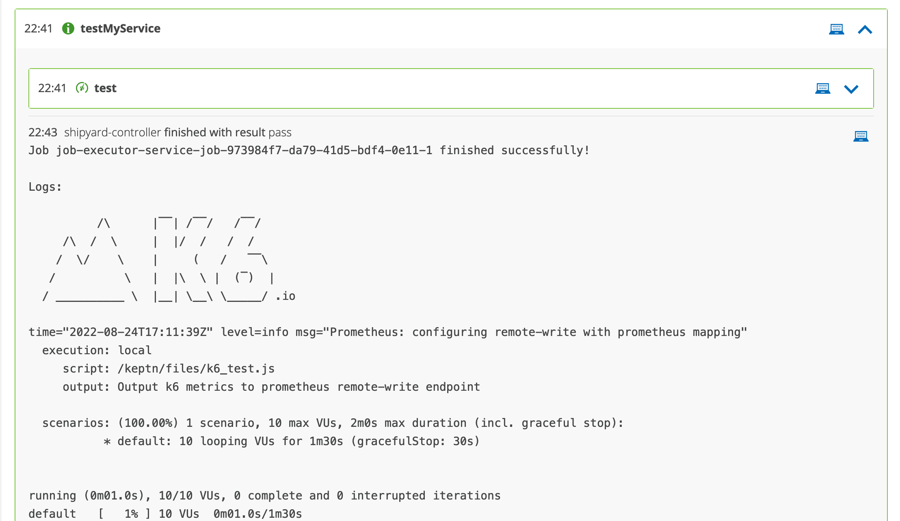
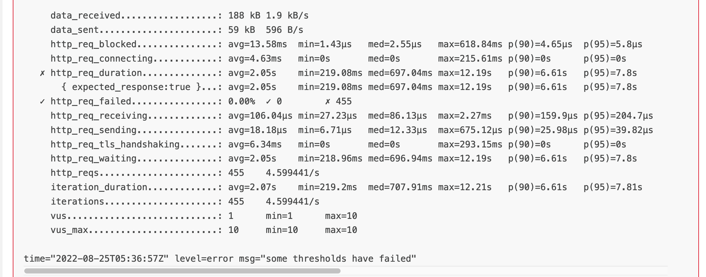
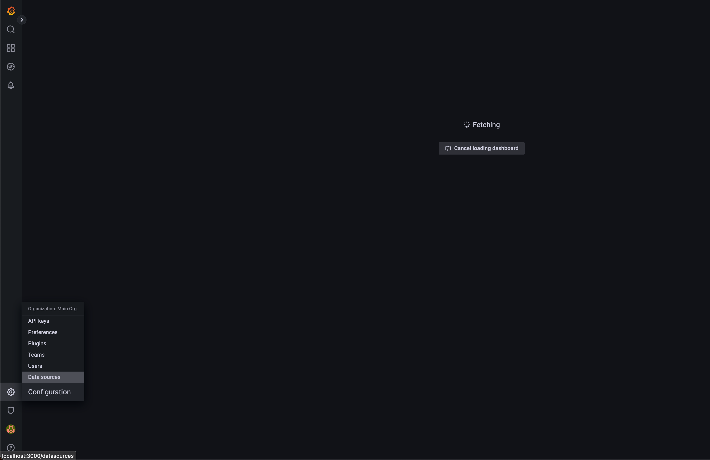
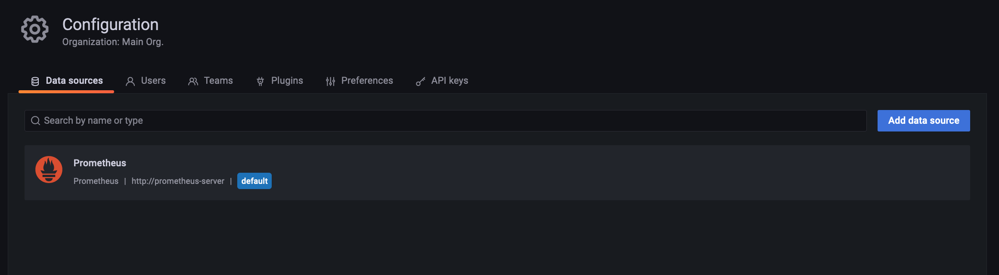
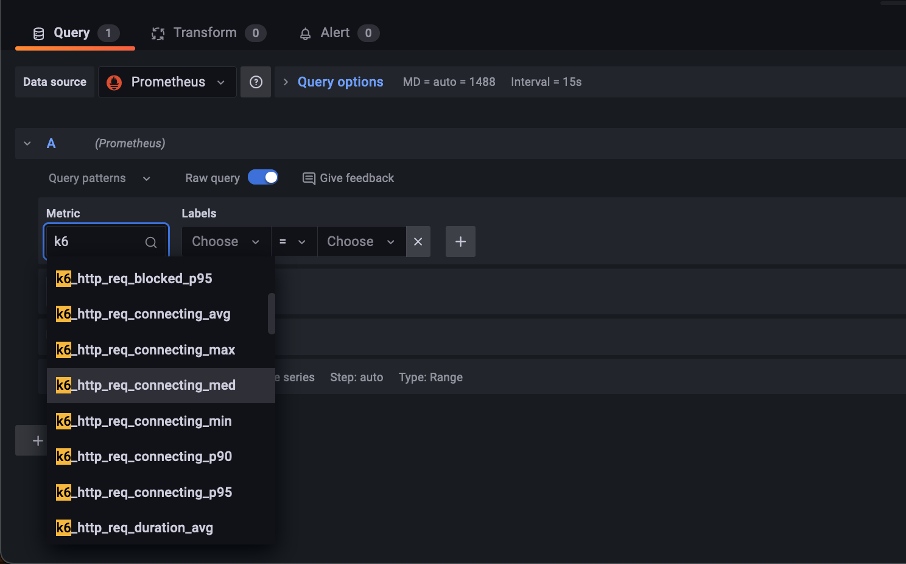
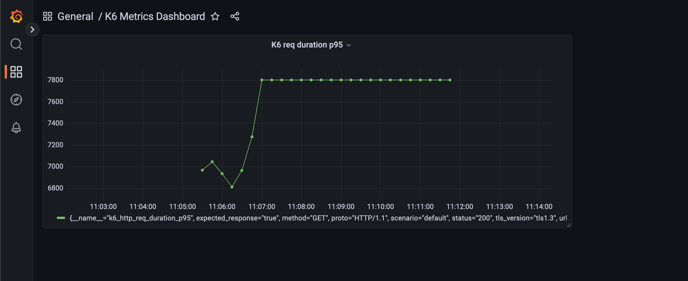

# Performance Testing in Keptn using K6 : Prometheus Remote Write Extension [Part - 2]

In the [previous tutorial](../k6-jes-example/README.md) we ran K6 script using Job Executor Service. In the current tutorial, we'll use [K6 Extension](https://k6.io/docs/extensions/) for publishing the test metrics to external tools. There are lots of available K6 extensions, explore them [here](https://k6.io/docs/extensions/getting-started/explore/). We'll use K6 Extention of Prometheus to export the test metrics. (Github: [xk6-output-prometheus-remote](https://github.com/grafana/xk6-output-prometheus-remote))

## K6 Extensions

K6 extensions are useful for expanding the potential use cases of K6. They allow us to create custom K6 binaries to support our use cases. Currently K6 supports two ways to extend it's native functionality:

1. Extend the JavaScript APIs available to your test scripts
2. Handle the test metrics generated (Ex. Write them to external tools like Prometheus, Dynatrace, etc)

### xk6 
[***xk6***](https://github.com/grafana/xk6/) is command-line tool and framework written in Go used for building custom K6 binary. Let's take a look the general flow of building a K6 binary for Prometheus remote write:

1. Install xk6
```bash
go install go.k6.io/xk6/cmd/xk6@latest
```


2. Build K6 binary using xk6
```bash
xk6 build --with github.com/grafana/xk6-output-prometheus-remote@latest
```

3. Set the Environment Variables required  
```bash
K6_PROMETHEUS_REMOTE_URL=http://localhost:9090/api/v1/write
```

4. Run k6... Here use `-o` flag  
```bash
./k6 run script.js -o output-prometheus-remote
```

This is how K6 extension can be used. Let's take a look at how we can use Job Executor Service for running K6 extension now and output test metrics to Prometheus.


## Setup

We'll need three things set-up for this tutorial: 
1. Project running K6 using Job Executor Service
2. Prometheus installation
3. Grafana Installation

### Standard K6 service using JES

Please follow the [previous tutorial](../k6-jes-example/README.md). This will help you setup 
1. Keptn
2. Job Executor Service
3. Keptn Project using K6 for performance testing

### Prometheus Installation

Since our Job Executor Service would be running in a K8s cluster, we'll have to install Prometheus in Kubernetes too for making the communication for remote write to Promethues possible. `localhost` won't be accessible there. Let's install it using Helm

```bash
helm repo add prometheus-community https://prometheus-community.github.io/helm-charts

helm install prometheus prometheus-community/prometheus
```

For more information please follow this [link](https://artifacthub.io/packages/helm/prometheus-community/prometheus)

#### Enabling Remote Write in Prometheus

This will install Prometheus on K8s. For K6 extension of Prometheus, we have to enable remote write too for accessing the `api/write/v1` API. We need to edit the `prometheus-server` deployment for that. We can do this by using the command
```bash
kubectl edit deployments prometheus-server
```

In this file, we would have to add this line in `args` to enable remote write `--web.enable-remote-write-receiver` for `prometheus` image. A part of file after editing should look like this 
```yaml
      - args:
        - --storage.tsdb.retention.time=15d
        - --config.file=/etc/config/prometheus.yml
        - --storage.tsdb.path=/data
        - --web.console.libraries=/etc/prometheus/console_libraries
        - --web.console.templates=/etc/prometheus/consoles
        - --web.enable-lifecycle
        - --web.enable-remote-write-receiver
        image: quay.io/prometheus/prometheus:v2.36.2
        imagePullPolicy: IfNotPresent
        livenessProbe:
          failureThreshold: 3
          httpGet:
```
Other `args` may be different, but `--web.enable-remote-write-receiver` should be present.

### Grafana Installation

We'll use grafana for visualizing the metrics exported by K6 tests. We'll install it using helm 
```bash
helm repo add grafana https://grafana.github.io/helm-charts

helm install grafana grafana/grafana
```

For more information please follow this [link](https://github.com/grafana/helm-charts)

Now that setup of Keptn, JES, Keptn project for running K6, Prometheus and Grafana is done, let's dive into steps for using K6 Extensions in Keptn.

> *Note:* We'll be using the same project we created in the last tutorial. 

## Building K6 Extention Docker Image

Job Executor Service requires a Docker Image for running any tool. We had mentioned the official docker image of standard K6 `loadimpact/k6` in the previous tutorial. There is no support of official docker images for K6 extensions project yet, although each K6 extension provides a `Dockerfile` for creating a docker image. We can use the same file. The docker file for `xk6-output-prometheus-remote` can be found [here](https://github.com/grafana/xk6-output-prometheus-remote/blob/main/Dockerfile).

```Dockerfile
# Multi-stage build to generate custom k6 with extension
FROM golang:1.17-alpine as builder
WORKDIR $GOPATH/src/go.k6.io/k6
ADD . .
RUN apk --no-cache add git
RUN CGO_ENABLED=0 go install go.k6.io/xk6/cmd/xk6@latest
RUN CGO_ENABLED=0 xk6 build \
    --with github.com/grafana/xk6-output-prometheus-remote=. \
    --output /tmp/k6

# Create image for running k6 with output for Prometheus Remote Write
FROM alpine:3.15
RUN apk add --no-cache ca-certificates \
    && adduser -D -u 12345 -g 12345 k6
COPY --from=builder /tmp/k6 /usr/bin/k6

USER 12345
WORKDIR /home/k6

ENTRYPOINT ["k6"]
```

Let's build this docker image and push to Dockerhub/registry.

```bash
docker build . -t jvenom/k6-prometheus

docker push jvenom/k6-prometheus
```

> For tutorial purpose I've used my account. Please update the docker image location here accordingly in the config of Keptn Service too :)

## Setting Environment Variable

We have to set environment variable for specifying Prometheus Remote-Write URL, TLS and HTTP basic authentication, etc. for the corresponsing use case. Job Executor Service allows us to load Kubernetes secrets for accessing enviroment varialbles. We can add the secret to the namespace where Job Executor Service is installed in K8s using the following command

```bash
kubectl -n keptn-jes create secret generic k6-details --from-literal=K6_PROMETHEUS_REMOTE_URL=http://prometheus-server.default/api/v1/write
```

We've used the K8s DNS here by specifying the `<deployment_name>.<namespace>` endpoint to Prometheus setup we have in K8s. 

We'll load these `k6-details` K8s secret in the config file of our Service. Let's modify the service now run K6 extension and view the metric on prometheus.

## Keptn Service Config

We shall be using the same `microserviceA` that we created in the previous tutorial and the same [`k6_test.js`](./production/microserviceA/files/k6_test.js) file. We had changed the test script for looking at the failing behaviour of K6 thresholds. Therefore, let's add the passing `k6_test.js` file back to the resources using the command

```bash
keptn add-resource --project k6-jes --service microserviceA --stage production --resource ./production/microserviceA/files/k6_test.js --resourceUri files/k6_test.js
```

Now that we have the k6_test.js file in place, let's take add the updated [config.yaml](./production/microserviceA/job/config.yaml) file too using command

```bash
keptn add-resource --project k6-jes --service microserviceA --stage production --resource ./production/microserviceA/job/config.yaml --resourceUri job/config.yaml
```

The new `config.yaml` file looks like this

```yaml
apiVersion: v2
actions:
  - name: "Run k6-prometheus"
    events:
      - name: "sh.keptn.event.test.triggered"
    tasks:
      - name: "Run k6 extensions with Keptn"
        files:
          - /files
        image: "jvenom/k6-prometheus"
        cmd:
          - "k6"
        args:
          - "run"
          - "--vus"
          - "10" 
          - "--duration"
          - "90s"
          - "/keptn/files/k6_test.js"
          - "-o"
          - "output-prometheus-remote"
        env:
          - name: k6-details
            valueFrom: secret
```

The changes we did from the previous tutorial are:
1. We've specified the Docker Image that we build for K6 extension as `jvenom/k6-prometheus` (Please update the image according to your image)
2. We've passed the `-o output-prometheus-remote` flag for prometheus output
3. For loading the enviroment variables, we've specified the `k6-details` secret that we had set in Job Executor Service's namespace in K8s

## Trigger Sequence

Let's trigger the sequence using the command 

```
keptn trigger sequence --sequence testMyService --project k6-jes --service microserviceA --stage production
```

You can trigger the sequence from Keptn Bridge too.

### K6 Execution Logs

In the output configuration we can see 
```logs
output: Output k6 metrics to prometheus remote-write endpoint
```



The other logs will be same as we saw in previous tutorial



For these instance the threshold of `500ms` for 95 percentile request duration. Let's take a look at the metrics written in Prometheus via Grafana.

## Grafana Dashboard

We can export Grafana to port `3000` on localhost using
```bash
kubectl port-forward deployment/grafana 3000
```

This will make the Grafana dashboard available on http://localhost:3000. It may ask for password, which can be found using command
```bash
kubectl get secret -n default grafana -o jsonpath="{.data.admin-password}" | base64 --decode ; echo
```

### Adding Data Sources

We'll have to add Prometheus as data source. Please refer to the below images to set up. 

1. Go to Data Sources Settings

2. Add Prometheus


### Creating Dashboard

Once this is done we can create a new Dashboard and add Panels by selecting the favorable metrics. The K6 metrics could be found with prefix `k6`



### Viewing K6 Metrics

Once the panels are added, we can se the time series data written by K6. I have selected `p95 request duration` metrics and from the `K6 stdout`, we saw it came around `7.8 seconds`. We ran the tests for `90 seconds`.



## Debug

### Remote Write Not Enabled

The below logs are given by `K6` if `Prometheus` is not setup with remote write enabled
```bash
time="2022-08-24T17:13:10Z" level=error msg="Failed to store timeseries." error="server returned HTTP status 404 Not Found: remote write receiver needs to be enabled with --enable-feature=remote-write-receiver"
```

> Make sure the `prometheus-server` deployment has been edited correctly in [this](#enabling-remote-write-in-prometheus) step and the deployment has restarted. You can check the status using the command
```bash
kubectl rollout status deployment/prometheus-server
```

### Secrets not found

The below logs show that K8s secrets were not found by Job Executor Service
```bash
Job job-executor-service-job-2f6fe6d6-9a86-440b-9991-4d79-1 failed: could not prepare env for job job-executor-service-job-2f6fe6d6-9a86-440b-9991-4d79-1: could not add env with name k6-details, valueFrom secret: secrets "k6-details" not found
```

> For this, make sure the `namespace` given in [Setting Environment Variables](#setting-environment-variable) is of Job Executor Service only

## Demo Video

In this video I have presented the demo for the whole K6 using Job Executor Service demo - [Youtube](https://youtu.be/h0eAzoOnaqY?t=358)

## Next Tutorial

Please follow the [next tutorial](../k6-prometheus-quality-gate-example/README.md) for running Quality Gates Evaluation on these metrics exported by K6 to Prometheus.