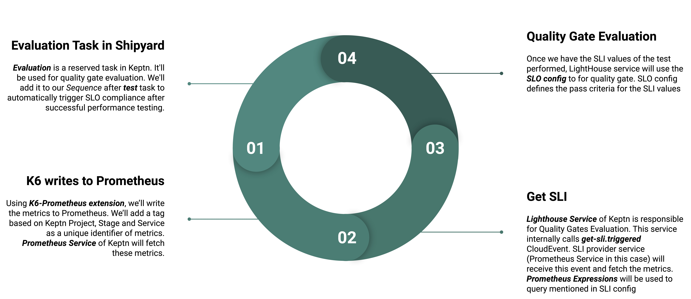
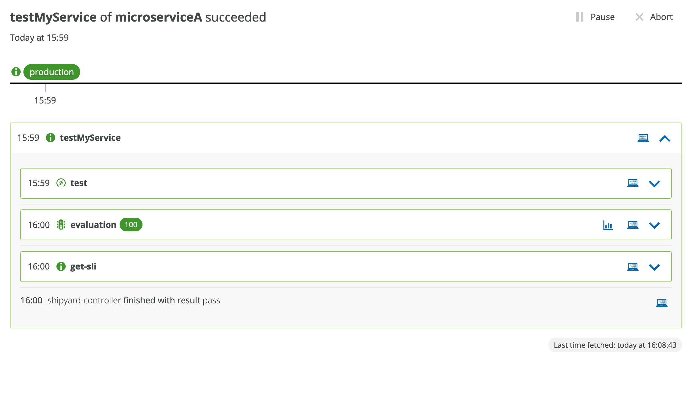
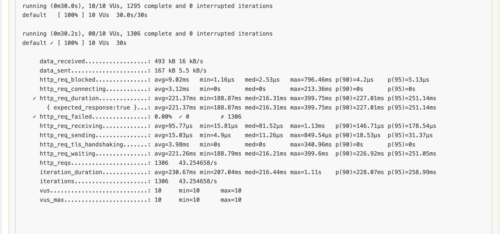
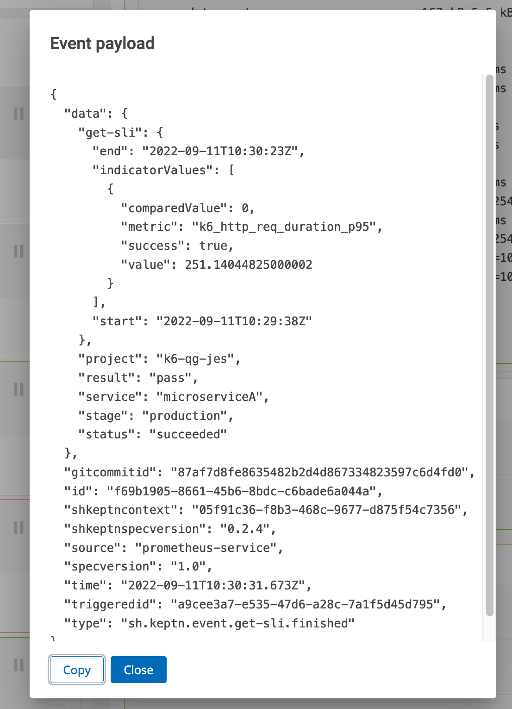

# Performance Testing in Keptn using K6 : Quality Gates Evaluation using K6 metrics in Prometheus [Part - 3]

In the [previous tutorial](../k6-prometheus-example/README.md) we ran K6 Prometheus Extension using Job Executor Service. In the current tutorial, we'll use those exported metrics for Quality Gates evaluation in in Keptn.  

## About Quality Gates

Keptn quality gates provide you a declarative way to define quality criteria of your service. Therefore, Keptn will collect, evaluate, and score those quality criteria to decide if a new release is allowed to be promoted to the next stage or if it has to be held back. You can read more about quality gates [here](https://keptn.sh/docs/concepts/quality_gates/).

The below image describes the Quality Gates Process.


## K6 & Quality Gates Workflow

This will the workflow of events for quality gates evaluation of K6 metrics in Prometheus.



## Setup

[Previous tutorial's](../k6-prometheus-example/README.md) setup of Prometheus and K6 extension using JES would be required. Apart from that, we'll have to setup Prometheus Service and Lighthouse Service.

### Prometheus Service

We'll have to install a SLI provider service which will inturn be called from Lighthouse Service. Prometheus Service of Keptn will do this job. Please install Prometheus Service from [here](https://github.com/keptn-contrib/prometheus-service).

Things to note while installing:
- Give correct namespace of installation of Prometheus of K8s
- Corresponding Prometheus endpoint wrt deployment name and namespace of K8s

### Lighthouse Service

Lighthouse Service will be responsible for valuating test results. Whenever an event of the type `sh.keptn.event.evaluation.triggered` is received, it will take first determine the SLI (Service Level Indicator) data source (e.g., Prometheus or Dynatrace), as well as the required SLIs for the project. Afterwards, it will send out an event of the type `sh.keptn.event.get-sli.triggered`, to inform the respective data source services to retrieve the values for the SLIs defined in the `slo.yaml` file. It will be installed by default during installation of Keptn, if not installed then please follow steps in this [link](https://github.com/keptn/keptn/tree/master/lighthouse-service).

#### Configuring a Data Soruce

We'll have to provide a data source for getting the SLI. For this we have to add a configmap for each project. We can do this by running this command

```bash
kubectl apply -f config-map.yaml 
```

The `config-map.yaml` looks like this, we specify the `name` as `lighthouse-config-{PROJECT_NAME}`(`k6-jes` in this case) and sli provider (`prometheus`).

```yaml
kind: ConfigMap
apiVersion: v1
metadata:
  name: lighthouse-config-k6-jes
  namespace: keptn
data:
  sli-provider: "prometheus"
```

More details of configuring a data source can be found [here](https://github.com/keptn/keptn/tree/master/lighthouse-service#configuring-a-data-source).

## Updating Shipyard

For quality gate evaluation, we'll have to add `evaluation` task to our project. This will automatically trigger SLO compliance after `test` task has succeeded. So now, the updated `shipyard.yaml` file looks like this

```yaml
apiVersion: "spec.keptn.sh/0.2.2"
kind: "Shipyard"
metadata:
  name: "shipyard-jes-k6-sample"
spec:
  stages:
    - name: "production"
      sequences:
        - name: "testMyService"
          tasks:
            - name: "test"
            - name: "evaluation"
```

For our `k6-jes` project, it can be updated as mentioned in this [link](https://keptn.sh/docs/0.19.x/manage/update/)
1. Delete the project and create a new project
2. Modify the project files from Git Upstream Repo

If you're following the first step then please maintain the current state of project by going through previour tutorials and adding the resources. 

## Modifying Job Executor Service Config

Since, multiple projects and services could be using K6 for testing. Therefore, we need to add a unique identifier for Prometheus metrics. We can do this by adding `tags` in test execution. We need to modify the `k6 run` command in the `config` file of Job Executor Service as shown below
```yaml
apiVersion: v2
actions:
  - name: "Run k6-prometheus"
    events:
      - name: "sh.keptn.event.test.triggered"
    tasks:
      - name: "Run k6 extensions with Keptn"
        files:
          - /files
        image: "jvenom/k6-prometheus"
        cmd:
          - "k6"
        args:
          - "run"
          - "--vus"
          - "10" 
          - "--duration"
          - "30s"
          - "/keptn/files/k6_test.js"
          - "-o"
          - "output-prometheus-remote"
          - "--tag"
          - "job=$(KEPTN_SERVICE)-$(KEPTN_PROJECT)-$(KEPTN_STAGE)"
        env:
          - name: k6-details
            valueFrom: secret
```

We use enviroment variables here. We can add this config using command

```bash
keptn add-resource --project k6-jes --service microserviceA --stage production --resource ./production/microserviceA/job/config.yaml --resourceUri job/config.yaml
```

## Adding SLI config

A SLI configuration is a yaml file as shown below:

```yaml
---
spec_version: '1.0'
indicators:
  k6_http_req_duration_p95_sli: k6_http_req_duration_p95{job='$SERVICE-$PROJECT-$STAGE'}
```

We can use **_Prometheus Expressions_** to get the SLI. We're using `k6_http_req_duration_p95` metric exported by K6 Prometheus extension here. We use the `job='$SERVICE-$PROJECT-$STAGE'` tag we had mentioned in K6 test execution command here to help us differentiate between the metrics of other projects and services in Prometheus. Please read more about Prometheus SLI Provider [here](https://github.com/keptn-contrib/prometheus-service#prometheus-sli-provider) for more advance used. 

To store this configuration, you need to add this file to a Keptn's configuration store, e.g., using the `keptn add-resource` command:

```bash
keptn add-resource --project k6-jes --service microserviceA --stage production --resource ./production/microserviceA/prometheus/sli.yaml --resourceUri prometheus/sli.yaml
```

The path here needs to be `prometheus/sli.yaml`.

## Defining Quality Gate Config

The `SLO.yaml` file would look like this

```yaml
---
spec_version: '0.1.0'
comparison:
  compare_with: "single_result"
  include_result_with_score: "pass"
  aggregate_function: avg
objectives:
  - sli: k6_http_req_duration_p95_sli
    pass:
      - criteria:
          - "<1000"
    warning:
      - criteria:
          - "<500"
total_score:
  pass: "90%"
  warning: "75%"
```

We use the `k6_http_req_duration_p95_sli` SLI we mentioned in `sli.yaml` file and set criteria of `pass` and `warning` around that. For more advanced use of `slo.yaml` file, please follow the guide present [here](https://github.com/keptn/keptn/tree/master/lighthouse-service#defining-service-level-objectives-slos)

This file needs to inside the project directory, using this command

```bash
keptn add-resource --project k6-jes --service microserviceA --stage production --resource ./production/microserviceA/slo.yaml --resourceUri slo.yaml
```

By adding `sli.yaml` and `slo.yaml`, we should be able to do the SLO compliance check too now! Let's take a look by triggering the event and seeing how SLI looks like by triggering a sequence :)

## Trigger Sequence

Let's trigger the sequence using the command 

```
keptn trigger sequence --sequence testMyService --project k6-jes --service microserviceA --stage production
```

You can trigger the sequence from Keptn Bridge too.

### Sequence Tasks

We can now see `evaluation` and `get-sli` tasks too after `test` task.



### K6 logs

These are the K6 metrics we can see from the logs. 



### SLI Values

After the `test` task succeeds, `evaluation` task get's called which calls the `get-sli` task. Here the Prometheus Service will fetch the SLI metrics



As we can see here, the `p95 request duration` is `251.14ms`. It's same in both K6 logs and the SLI values we got from Prometheus. So the data we are fetching is correct. 

### Quality Gate Evaluation Board

From the evaluation board we can keep track of the scores of evaluation of our service.


## Demo Link

TODO: Add final GSOC demo link.